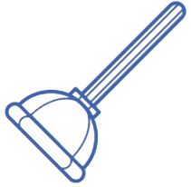
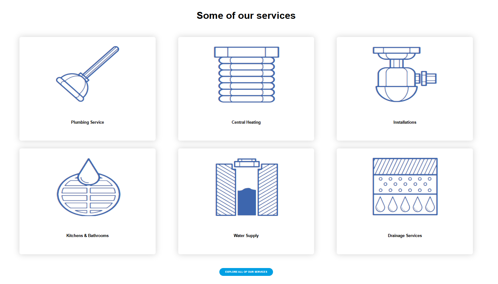
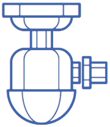

# first-project
# 🔧 Plumber Website

### Plumbing Services Landing Page

A simple plumbing website built with HTML and CSS.

[🌐 Live Demo](https://elhamnosani.github.io/first-project/)

 

---

## 📸 Preview

---

## 📖 About

This project is a plumbing services landing page created to practice HTML structure and CSS styling techniques.

The design focuses on creating a clean and professional appearance for a local plumbing business.

---

## ✨ Features

- Modern landing page design
- Service showcase section
- Contact section
- Custom styling with CSS
- Clean layout structure

---

## 🛠️ Technologies

- HTML5
- CSS
---

## 🎯 What I Practiced

- Semantic HTML
- CSS Positioning
- Flexbox
- Hover Effects
- Project Structure

---

## 🌐 Live Demo

👉 https://elhamnosani.github.io/first-project/

---

## 👩‍💻 Author

**Elham Nosani**

GitHub:
https://github.com/elhamnosani

---

⭐ Feel free to explore the project and share your feedback.
